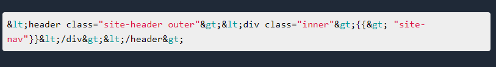

# highlight-code-blocks

highlight-code-blocks is library aimed at react developers who want to implement highlight.js in their project.

 

## Usage
 
I didnt get time to make this into a working package, please find the code in the index file. If ypu have any doubt please refer this site [milindsoorya.blog](https://www.milindsoorya.site/)

 

## Contributing

Pull requests are welcome. For major changes, please open an issue first to discuss what you would like to change.

## License

[MIT](https://choosealicense.com/licenses/mit/)
